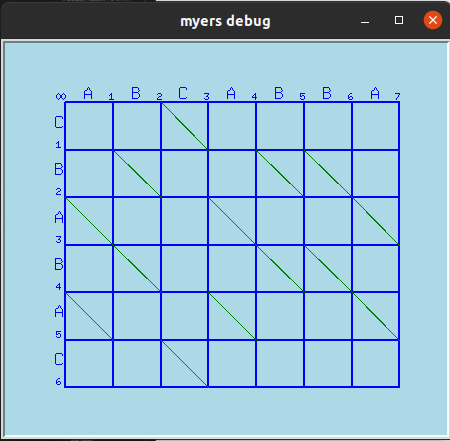
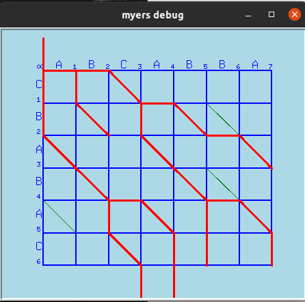
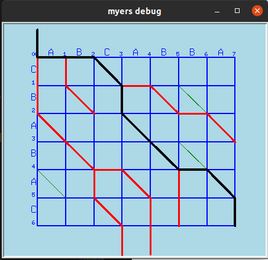

# PyMyers
- PyMyers is a myers diff algorithm implementation in python


# Features
- Extended the myers algorithm to support **real-time** calculations
- Diff trace can be drawn with animation
<figure class="">
    
    
    
</figure>

- Using a tree data structure to store and trace diff tracks
- Inputs can be easily logged and restored

# Installation
```
pip install pymyers
```
or install editablely
```
git clone https://github.com/leowooong/PyMyers.git
cd PyMyers
pip install -e ./
```
# Usage
### diff
``` python
from pymyers import MyersRealTime, Diff

# set two sequences
a = "ABCABBA"
b = "CBABAC"

# diff from a to b
matches = [(2, 0), (3, 2), (4, 3), (6, 4)]
deletes = [0, 1, 5]
inserts = [1, 5]
diff = Diff(matches, deletes, inserts)

# calculate diff
myers = MyersRealTime(a, b)
diff_re = myers.diff()
assert diff_re == diff

# show diff
print('matches:', [a[c[0]] for c in matches])
print('deletes:', [a[c] for c in deletes])
print('inserts:', [b[c] for c in inserts])

```
### real-time diff
``` python
a = "0123456789"
b0 = ""
b1 = "0"
b2 = "34"
b3 = "687"
b4 = "890"
b = [b0, b1, b2, b3, b4]

myers = MyersRealTime(a, b[0])
for bi in b[1:]:
    print(myers.update(bi))
```
### plot
``` python
a = "ABCABBA"
b = "CBABAC"

myers = MyersRealTime(a, b, plot=True, animation = True, plot_size = 50)
diff_re = myers.diff()
```
### log 
``` python
a = "ABCABBA"
b = "CBABAC"

myers = MyersRealTime(a, b, log_path='./log')
diff_re = myers.diff()

# restore log
from pymyers import Debug
log_folder = "./log/log-myers-2022-12-21-18:19:11"
a, *b = Debug.read(log_folder)
```
### custom compare function
``` python
a = [1, 2, 3, 4, 5]
b = "13456"
cmp = lambda a, b: a == int(b)

myers = MyersRealTime(a, b, cmp=cmp)
diff_re = myers.diff()

```

# References
- Thanks to [Eugene W. Myers](http://www.xmailserver.org/diff2.pdf) for the development of the myers algorithm and [James Coglan](https://blog.jcoglan.com/2017/02/12/the-myers-diff-algorithm-part-1/) for the clear explanation to the myers algorithm 